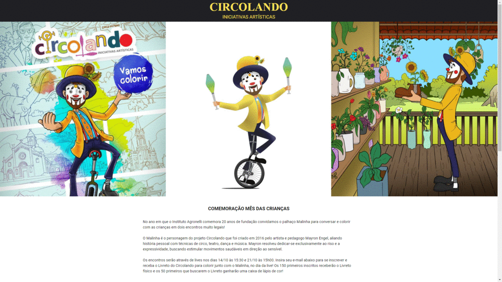

<h1 align="center">
Circolando
</h1>

<p align="center">Circolando is a web application that was created for Children's day.</p>

<p align="center">
  <a href="https://opensource.org/licenses/MIT">
    
  </a>
</p>

<div align="center">
  
</div>

<p align="center">
  Version 1.0
</p>

---

## Techs
- ReactJS
- Next.js
- Chakra UI
- EmailJS


## Getting started

To clone and run the application, you will need to have [Git](https://git-scm.com), [Node.js](https://nodejs.org) + [Yarn](https://yarnpkg.com) installed on your machine. With all programs installed, run the following command lines:


```bash
# Clone this repository
$ git clone https://github.com/Vitorhr10/nextjs-functions

# Access the repository
$ cd nextjs-functions

# Install the dependencies
$ yarn install

# Run application
$ yarn dev
```
